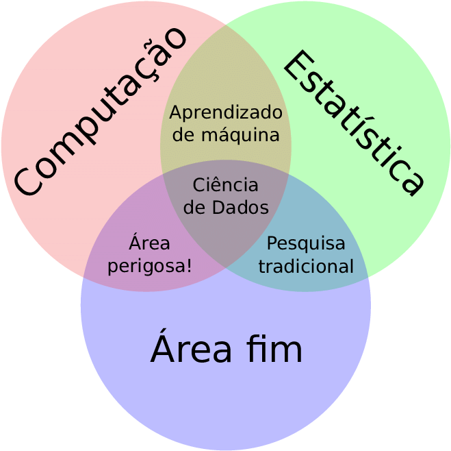

# Ciência de dados ambientais

Conforme @kadiyala2017, a Ciência de Dados é definida como um campo interdisciplinar que tem como principal objetivo a "extração de relacionamentos significativos ou *insights* de padrões em bancos de dados multidimensionais por meio da aplicação de métodos matemáticos, computacionais e científicos relevantes". Portanto, basicamente, a Ciência de Dados tem a capacidade de transformar dados em informações úteis, fazendo com que a tomada de decisão seja fundamentada [@mendes2022]. 

```{r, echo=FALSE}

```

A área ambiental, assim como diversas outras áreas do conhecimento, cada vez mais está coletando grandes quantidades de dados complexos. Dessa forma, na última década houve um aumento exponencial da quantidade de dados a serem analisados. Com isso, o potencial da aplicação do Data Science & Analytics no desenvolvimento de teorias orientadas a dados já está sendo reconhecido [@mendes2022; @kadiyala2017; @longbing2017]. 

Conforme @mendes2022, "A sustentabilidade precisa de Ciência de Dados para tentar resolver os problemas fundamentais, e a Sustentabilidade traz novos desafios para a Ciência de Dados". Portanto, a aplicação da ciência de dados em *datasets* ambientais torna-se proveitosa não só visando o aumento da eficiência e eficácia da gestão da sustentabilidade, mas, também, ao desafiar o desenvolvimento dos conhecimentos envolvidos na aplicação da Ciência de Dados.

