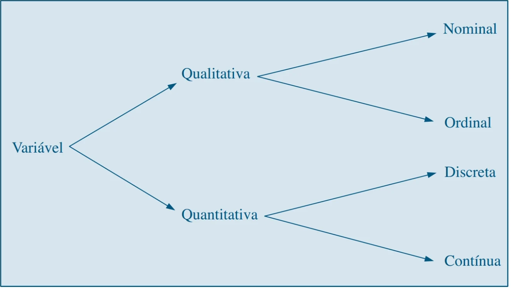
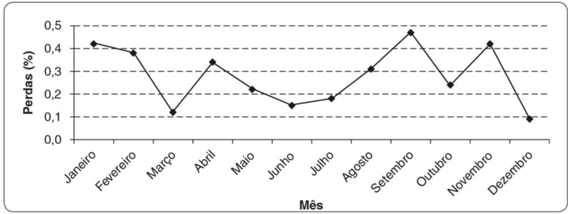
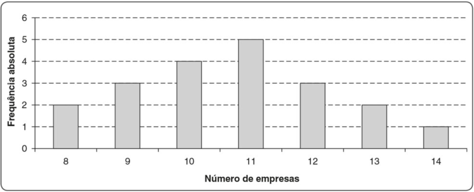
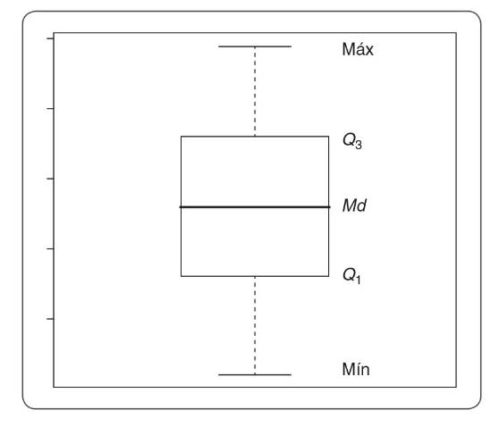

# Análise Exploratória de Dados 

A **Análise Exploratória de Dados** (EDA) é uma forma de utilizar ferramentas gráficas e estatísticas apropriadas da linguagem R na exploração de dados. A partir da visualização, transformação e modelagem de dados, essa análise explora os dados de forma sistemática [@wickham2022].

Para aplicar a EDA, de acordo com @wickham2022, basta inicialmente gerar questões sobre os dados, utilizar as funcionalidades do R para encontrar respostas e utilizar o que foi aprendido para gerar novas questões. Portanto, essa análise é um ciclo iterativo.

## Introdução à Estatística
Para aplicar a Ciência de Dados é essencial o uso da Estatística. Conforme @montgomery2021, "Estatística é a ciência de dados". Em um conjunto de dados, a estatística descritiva detalha e resume as suas principais características, de forma que permite maior entendimento do comportamento desse conjunto. Esse é um dos principais aspectos importantes para facilitar a interpretação e análise de dados em Data Science [@favero2017; @montgomery2021].


### População e amostra

A **População** é um conjunto de observações relacionadas a indivíduos com uma característica em comum. Já a **Amostra** é um subconjunto da população, com uma parte das observações relacionadas à população. A partir da amostra realizam-se inferências sobre as características da população. 

É importante que a amostra seja representativa para que os resultados não sejam deturpados.

### Tipos de variáveis
Uma variável pode ser definida como uma característica da amostra ou população. Para
aplicar os cálculos de estatísticas e realizar as representações gráficas é importante realizar a classificação da variável. Os tipos de variáveis são: Qualitativa ou não métrica e Quantitativa ou métrica. O primeiro tipo está relacionado com variáveis que categorizam os dados, de forma quenão seja possível medí-los ou realizar cálculos. Já o segundo, relaciona-se com variáveis que podem ser contadas ou mensuradas [@favero2017].

```{r, echo=FALSE}

```

Dentre as variáveis qualitativas, também chamada de variáveis categóricas, existem
dois tipos: Nominal e Ordinal. Enquanto na Nominal não possível realizar nenhuma ordenação,
na Ordinal existe uma ordem para os seus resultados. Para analisar essas variáveis podem
ser utilizadas tabelas de distribuição de frequência e gráficos [@morettin2017; @favero2017].

De forma similar, existem dois tipos para as variáveis quantitativas: Discreta e Contínua.
As Discretas possuem valores inteiros, ou seja, não assumem valores decimais e, em sua maioria, resultam de uma contagem. Já as Contínuas possuem valores contidos nos números reais e resultam de uma mensuração. Podem ser analisadas a partir de medidas de posição, dispersão e
forma [@morettin2017; @favero2017].

## Sumarização numérica de dados

Resumos numéricos de dados são fundamentais para realizar inferências estatísticas, porque, de acordo com Montgomery & Runger (2021), "*permitem ao engenheiro focar nas características importantes dos dados ou ter discernimento acerca do tipo de modelo que deveria ser usado na solução do problema*". Por isso, torna-se útil descrever numericamente, a partir de medidas de posição, variabilidade e forma, características dos dados.

### Medidas de Posição

#### Média

A média é a divisão da soma de todos os valores da série pelo número de obervações n.


  $\bar{x}=\frac{x_{1}+x_{2}+x_{3}...x_{n}}{n}=\frac{\sum x_n}{n}$

#### Mediana

Em um conjunto de valores ordenados, a mediana é o valor que ocupa a posição central. Portanto, a mediana divide a distribuição de valores na metade.

#### Moda
  Em um conjunto de valores, a Moda seria o valor que ocorre com maior frequência. Ou seja, o valor que mais se repete.
  
### Medidas de Variabilidade

#### Amplitude

Em um conjunto de observações, a Amplitude é a diferença entre o maior valor e o menor.

#### Variância

Para uma amostra de *n* observações, a Variância será:

 $s=\frac{\sum(x_{i}-\bar{x})^{2}}{n-1}$

#### Desvio Médio (*Standard Deviation*)

Para uma amostra de *n* obervações, o Desvio Padrão (SD) será a raiz quadrada positiva da Variância.

#### Quartis, Decis e Percentis

Os **Quartis** dividem um conjunto de obervações ordenados em 4 partes iguais; os **Decis**, em 10; e, os **Percentis**, em 100.

### Medidas de Forma

As medidas de forma permitem a verificação de como um conjunto de dados está se comportando em sua distribuição. Gráficos de distribuição de frequência e histogramas são ferramentas importantes para essa verificação.

#### Assimetria

Distribuições em forma de sino são simétricas, já que a média, mediana e moda desse conjunto de dados são iguais. Ou seja, a metade esquerda do histograma é aproximadamente igual à metade direita.

Distribuições assimétricas possuem uma concentração de seus dados, à direita ou à esquerda, no histograma. Ou seja, apresentam uma "cauda" em uma das extremidades. Se a distribuição desses dados estiverem concentrados à direita, são dados com **assimetria positiva**. Se concentrados à esquerda, **assimetria negativa**.

##### Coeficiente de Assimetria de Pearson

$A_s=\frac{3*(\bar{x} - Md)}{s}$

#### Curtose

Curtose indica o grau de achatamento de uma distribuição em relação à curva normal. 

##### Coeficiente de Curtose

$C=\frac{Q_3-Q_1}{2*(P_{90} - P_{10})}$

A curva normal possui C=0,263.

## Representação gráfica
Como a representação gráfica de variáveis qualitativas está associada às frequências associadas às categorias, os gráficos mais utilizados são de barras e de composição em setores (gráfico de pizza ou retângulos). Em um gráfico de barras, visualiza-se a tabela de frequências de forma que as categorias apresentam-se no eixo x e, a frequência absoluta ou relativa, no eixo y. É possível que os eixos estejam invertidos, ou seja, no eixo x apresentam-se as frequências e, no eixo y, as categorias. Já os gráficos de composição de setores podem apresentar a contagem de ocorrências das categorias de uma variável e também em relação ao seu total de contagens, ou seja, respectivamente as frequências absolutas e relativas das categorias da variável[@morettin2017; @bruce2019].

As representações gráficas para viariáveis quantitativas apresentam maior variedade, porque, além dos gráficos usados para variáveis qualitativas, ainda é possível realizar gráficos de linhas, de dispersão, histogramas, de ramo-e-folhas e box-plots [@morettin2017; @favero2017].

A representação gráfica de pontos formados pela intersecção no eixo x e y ligados por uma linha reta é o gráfico de linhas. Conforme apresentado por @favero2017, esse gráfico poderá representar o comportamento de somente uma variável. Os valores numéricos da variável apresentam-se no eixo y e o eixo x apresenta a distribuição dos dados uniformemente ao longo do tempo. Portanto, a partir dessa representação é possível visualizar a evolução (ou tendência) dos dados da variável [@favero2017]. O gráfico de dispersão é muito semelhante ao de linhas, porém, nesse caso, os pontos não são ligados por uma reta. Além disso, os intervalos de distribuição dos dados, normalmente, são irregulares. Existe a possibilidade de utilizar essa representação para duas variáveis simultaneamente [@favero2017].

```{r, echo=FALSE}

```

Segundo @morettin2017, um gráfico de barras contíguas é um histograma. Os
valores da variável apresentam-se no eixo x e a distribuição de frequências no eixo y. Como a área de cada retângulo é proporcional à respectiva frequência, a área total do histograma sempre será igual a um. Portanto, a primeira etapa para a construção de um histograma é a construção da tabela de frequências, calculando as frequências absoluta e relativa e suas respectivas frequências acumuladas. Além disso, quanto maior a quantidades de dados da categoria (ou classe), mais alto será a barra (ou retângulo) [@morettin2017].

```{r, echo=FALSE}

```

O boxplot apresenta o valor mínimo, primeiro, segundo e terceiro quartil, mediana e o valor máximo de uma determinada variável. Ou seja, é a representação de medidas de posição da variável, as quais serão apresentadas a seguir. O primeiro quartil apresenta 25% dos dados; o segundo, 50%, o que também é a mediana porque os dados estejam ordenados; e o terceiro, 75%. Com o gráfico, é possível verificar se existem dados discrepantes localizados fora dos limites superior e inferior.

```{r, echo=FALSE}

```

## Aplicação {-}

### INMET

Para a aplicação, será utilizada a base de dados do Instituto Nacional de Meteorologia (INMET) de precipitação e de dias de precipitação do Mirante de Santana em São Paulo.

Realizaremos a análise exploratória da precipitação total ao longo dos anos (1990-2022).
 
Para importar a base de dados em .csv, utiliza-se a função read.csv2() e insere-se como argumento o *diretório*:

```{r,echo=FALSE, eval=FALSE}
options(repos = list(CRAN="http://cran.rstudio.com/"))
options("install.lock"=FALSE)
install.packages("dplyr")

# Para resolver o problema com o pacote rlang, basta reinstalar o dplyr

```

```{r,message=FALSE,warning=FALSE}

library(readr)

#Importar base de dados
inmet0 <- read.csv2("Data/INMET_SP.csv", header = TRUE, sep = ";", dec = ",")

```

É importante lembrar que read.csv() é utilizado quando os valores são separados por vírgula e decimais por ponto; e, read.csv2(), quando são separados por ponto e vírgula e os decimais por vírgula.

Para visualizar a tabela importada, basta executar a função View():
```{r,message=FALSE,warning=FALSE}

#Visualização da base de dados
View(inmet0)

# Omitir valores NA da base de dados
inmet <- na.omit(inmet0)

```

Para iniciar a exploração dos dados, inicialmente será utilizada a função str() que exibe de forma compacta a estrutura da tabela importada.

```{r,message=FALSE,warning=FALSE}

str(inmet)

```
Continuando, será utilizada a função ´summary()´ para apresentar o sumário de estatísticas descritivas (média, mediana, mínimo, máximo, 1º quartil, 3º quartil e valores faltantes (NA)), já que as variáveis de precipitação total e número de dias de precipitação são numéricas.

```{r,message=FALSE,warning=FALSE}

summary(inmet)

```

Inicialmente, os cabeçalhos da coluna serão modificados para facilitar a análise:

```{r,message=FALSE,warning=FALSE}
#Explorando os cabeçalhos da base de dados
names(inmet)

# Modificando os cabeçalhos
colnames(inmet)[c(1,2,3)] <- c("data","dias_de_precipitacao","precipitacao_total")

View(inmet)
```

Para continuar explorando os dados, realizou-se um gráfico de linhas a fim de analisar o comportamento da precipitação em relação às datas.

```{r,message=FALSE,warning=FALSE}

month_year <- format(as.Date(inmet$data, format = "%d/%m/%Y"),"%Y/%m")

View(month_year)

library(ggplot2)

ggplot(inmet,
       aes(x = month_year, y = precipitacao_total)) +
       geom_line(linetype="dashed", color="blue", aes(group=1)) +
       geom_point() + 
        scale_x_discrete(guide = guide_axis(check.overlap = TRUE)) +
        scale_y_discrete(guide= guide_axis(check.overlap = TRUE))
```

No momento, nos interessa analisar a precipitação ao longo dos anos de análise. Por isso, essa variável será adicionada como uma coluna ao dataset inicial:

```{r,message=FALSE,warning=FALSE}
ano <- format(as.Date(inmet$data, format = "%d/ %m/ %Y"),"%Y")
inmet_new <- cbind(inmet, ano)

View(inmet_new)
```

Analisando o histograma da precipitação total, verifica-se que a sua distribuição é positiva e assimétrica:

```{r, warning = FALSE, message=FALSE}
# Histograma

library(ggplot2)

ggplot(data=inmet_new, aes(x=precipitacao_total)) +
  geom_histogram() +
  theme_bw() 
```

A partir do boxplot abaixo, é possível visualizar que 75% dos valores de precipitação estão entre 50mm e aproximadamente 200mm; a média stá próxima de 150mm e a mediana de 100mm; e, por fim, o valor máximo está próximo de 400 mm. Existem observações além do limite máximo, o que é um indício de outliers, ou seja, observações atípicas (fora do normal).


```{r, warning=FALSE, message=FALSE}
ggplot(data=inmet_new, aes(y=precipitacao_total)) +
  geom_boxplot() +
  theme_minimal()
```
Primeiramente, será encontrada a média de precipitação por ano analisado, com um intervalo de confiança de 95% (escore-x da curva normal igual a 1,96). Com o objetivo de deixar o código mais organizado, será utilizado o [operador pipe](https://www.youtube.com/watch?v=qHCBG14tKns).  

```{r,message=FALSE,warning=FALSE}

#Média das precipitações por ano

#instalando o pacote para utilizar o operador pipe %>% 
library(dplyr) 

# Criando tabela de statísticas
tabela_stats <- inmet_new %>%
  group_by(ano) %>%
  summarise(n_obs = n(), media = mean(precipitacao_total), desvio_padrao = sd(precipitacao_total)) %>% 
  mutate(erro = 1.96*desvio_padrao/sqrt(n_obs), 
         limite_superior = media + erro,
         limite_inferior = media - erro)

#Visualizando a tabela criada com os dados estatísticos

View(tabela_stats)
```

Com o objetivo de analisar a graficamente os valores de precipitação por ano, será utilizado um gráfico de barras com os erros padrões das amostras. Utiliza-se o erro padrão e não o desvio padrão porque, neste caso, estamos interessados na variabilidade das médias das amostras e não na variabilidade das observações dentro da amostra.

```{r,message=FALSE,warning=FALSE}

#Plotando os valores com seus respectivos erros
ggplot (data = tabela_stats, aes(x = ano, y = media, fill = ano)) +
  geom_col() +
  geom_errorbar(aes(ymin=limite_inferior, ymax=limite_superior)) +
  ggtitle("Média das precipitações por ano") +
  xlab("") +
  ylab("") +
  theme_bw() +
  theme(legend.position = "none")

```

