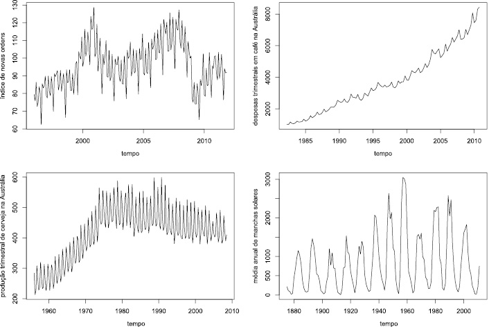

# Análise de séries temporais

Qualquer conjunto de observações ordenadas no tempo são chamadas de [Séries Temporais](https://www.youtube.com/watch?v=T4N8ZhmiUEM&list=PLW1zGvUGqyiEw1O3HAcjezB9esyI8R8xe&index=5). No caso da Engenharia Ambiental e Urbana, podem ser citados alguns exemplos: valores diários de poluição, valores mensais de temperatura, temperaturas máximas e mínimas diárias ou precipitação atmosférica anual em uma cidade, entre outros [@morettin2018]. 

É suposto que, em uma análise de série temporal, "*há um sistema causal mais ou menos constante, relacionado com o tempo, que exerceu influência sobre os dados no passado e pode continuar a fazê-lo no futuro. Este sistema causal costuma atuar criando padrões não aleatórios que podem ser detectados em um gráfico da série temporal, ou mediante algum outro processo estatístico*" [@reis2022].

É importante citar que identificar esses padrões não aleatórios na série temporal de uma variável de interesse é o objetivo da análise. A partir dessa identificação, é possível realizar previsões, orientando tomadas de decisões na área de interesse [@reis2022].

A partir de procedimentos estatísticos, é possível realizar a análise da série de dados de forma que seja possível realizar previsões, analisar causalidades e estudar periodicidades relevantes. Conforme [COSTA (2022)](https://www.youtube.com/watch?v=emnSZ7qKv9M&list=PLSDVadsSlXTCVcg95hQsEOVRnVwgaPTRC&index=2) e [SOARES (2020)](https://www.youtube.com/watch?v=ICY8gVN1ctc&list=PLW1zGvUGqyiEw1O3HAcjezB9esyI8R8xe&index=1), em resumo, nas séries temporais caracterizam-se por:

  1. Possuirem variáveis aleatórias;
  2. Observações altamente correlacionadas, principalmente porque medidas adjacentes (próximas no tempo) tendem a correlatas;
  3. Existência de fatores determinísticos, como tendência, sazonalidade e ciclos;
  4. Dificuldade em lidar com outliers;
  5. Mudanças fundamentais/abruptas.

De acordo com @reis2022 e @barros2017, séries temporais são compostas pelos seguintes padrões:

1) **Tendência (T)**: série temporal que segue determinada direção, não necessariamente linear, podendo também ser crescente ou decrescente. Exemplos podem ser: crescimento demográfico, ou mudança gradual de hábitos de consumo, ou qualquer outro aspecto que afete a variável de interesse no longo prazo;

2) **Variações cíclicas ou ciclos (C)**, flutuações nos valores da variável com duração superior a um ano, e que se repetem com certa periodicidade, que podem ser resultado de variações da economia como períodos de crescimento ou recessão, ou fenômenos climáticos como o El Niño (que se repete com periodicidade superior a um ano);

3) **Variações sazonais ou sazonalidade (S)**, flutuações nos valores da variável com duração inferior a um ano, e que se repetem todos os anos, geralmente em função das estações do ano (ou em função de feriados ou festas populares, ou por exigências legais, como o período para entrega da declaração de Imposto de Renda); se os dados forem registrados anualmente NÃO haverá influência da sazonalidade na série;

4) **Variações irregulares (I)**, que são as flutuações inexplicáveis, resultado de fatos inesperados como catástrofes naturais, decisões intempestivas de governos, etc.

Estes são estudados para controlar o efeito de cada componente a fim de analisar o comportamento de cada "série filtrada" e, ainda, analisar as particularidades de cada componente (COSTA, 2022).

```{r figura 3.1, echo=FALSE, fig.cap="Figura 3.1: Séries exibindo diferentes tipos de padrões (Fonte: BARROS et. al, 2022)"} 




```
De acordo com COSTA (2022), existem duas abordagens na análise de séries temporais:

  1. **Clássica**: descreve o comportamento da série por meio de componentes não observáveis, ou seja, a tendência, sazonalidade e ciclo. Os desvios em torno dos valores determinísticos^[Em um modelo determinístico, indepentemente dos conjuntos de entrada, o resultado será sempre o mesmo conjunto de saídas.] ocorrem por erros aleatórios e não pela natureza estocástica da série.
  
  
  2. **Moderna**: supões que a série temporal seja formada por um processo estocástico^[Processo estocástico: sequência de variáveis aleatórias cujas características probabilísticas não se alteram ao longo do tempo. Exemplo: No lançamento de dados cada face tem a mesma probabilidade de ficar para cima]. Sendo cada observação composta por um conjunto de variáveis aleatórias, estas são representadas por funções de densidade individuais. Para capturar sua característica estocástica, são utilizadas modelos estatísticos.

## Estacionaridade
Para realizar a abordagem de séries temporais assume-se que esta seja formada por um processo estocástico, como citado anteriormente. De forma resumida, uma série estacionária possui a mesma distribuição de probabilidade para cada observação.

A estacionaridade divide-se em: forte, em que a função densidade de probabilidade não varia no tempo e as distribuição são iguais para todo $t$; fraca, em que a média, variância e covariância permanecem constantes ao longo do tempo. A estacionaridade fraca é menos restritiva que a forte e, por isso, será a abordagem escolhida.

Uma série fracamente estacionária tem as seguintes características:

1. A média é igual a uma constante
2. A variância é constante e finita;
3. A covariância é dependente somente da diferença no tempo (h) entre duas medidas, sendo a covariância:

$$\tag{4.3}Cov(X_t,X_{t+h})=\sum(X_t-\overline{X_t})(X_{t+h}-\overline{X_{t+h}})$$, em que $X_t$ é a própria série temporal e $h$ é o intervalo de tempo entre as duas medidas.

Dessa forma, quando a covariância é positiva, a tendência é positiva entre $X_t$ e $X_{t+h}$. Quando a covariância é negativa, a tendência também é negativa. Se a covariância for nula, não existe tendência.

É importante citar que se uma série não for estacionária, modelos padrões podem não representar de forma adequada o processo gerador da série temporal e, por isso, não seria possível utilizar o modelo para realizar previsões ou outros objetivos da análise. Conforme o Teorema de Wald, a estacionariedade dá estabilidade e coerência ao modelo.

## Operador de diferenças
Dada uma série temporal {$y_t=y_{t=1}$}, o operador de diferenças transforma a série original em uma nova série formada por diferenças sucessivas:
$\nabla^dy_t$ é uma série diferenciada "d" vezes, sendo que $\nabla y_t=y_t - y_{t-1}$ é a primeira diferença da série.

Dessa forma, a segunda diferença da série será: $\nabla^2y_t = \nabla(\nabla y_t) = \nabla (y_t - y_{t-1}) = \nabla y_t - \nabla y_{t-1} = y_t - 2y_{t-1} + y_{t-2}$

Para a n-ésima diferença da série: $\nabla^n y_t = \nabla(\nabla y_t) = \sum_{r=0}^n (-1)^r \binom{n}{r} y_{t-r}$, em que $\binom{n}{r}=\frac{n!}{r!(n-r)!}$.

É mais comum que uma ou duas diferenças já sejam suficientes para tornar a série estacionária.

## Ruído branco
No ruído branco, toda a trajetória da série temporal é atribuida a fatores puramente aleatórios. Ou seja, variáveis aleatórias não correlacionadas em um processo estocástico ${\epsilon_t, t \in T}$  possuem média zero e variância constante, portanto, $\epsilon_t\sim RB(0,\sigma^2)$.

É representado como:
$$\tag{4.5}y_t=\epsilon_t$$

## Passeio aleatório
O passeio aleatório é representado por $\tag{4.6}y_t=y_{t-1}+\epsilon_t$ em que $\epsilon_t\sim RB(0,\sigma^2)$. Portanto, o valor da série em $t$ é igual ao valor da série em um instante anterior somado a um erro de média zero e variância constante.

É possível escrever o passeio aleatório em função de $y_0$:
$$y_t=y_0+\sum_{i=1}^t{\epsilon_i}$$
### Testes de raiz unitária
A raiz unitária indica que a série é uma realização de um processo estocástico não-estacionário. Portanto, uma série com raiz unitária precisa ser diferenciada para se tornar estacionária:

$$ y_t= y_{t-1} + \epsilon_t$$
$$y_t-(y_{t-1}) = y_{t-1} - (y_{t-1}) + \epsilon_t$$
$$\nabla y_t= e_{1t}$$
O número de diferenças necessárias para tornar uma série estacionária é chamado de **ordem de integração** da série. No exemplo acima, a primeira diferença de um passeio aleatório é estacionária e, portanto, passa a ser um ruído branco.

Um processo é dito ser integrado de ordem d se uma série temporal {$y_t_{t=1}^T$} é não estacionária. Porém, após d diferenças, o resultado é uma série temporal estacionária e, portanto, pode ser modelada por um modelo ARMA(p,q).

Para realizar o teste da raiz unitária, os mais utilizados é o teste Aumentado de Dickey-Fuller (ADF).

## Modelos autoregressivos
[Modelos autoregressivos](https://rpubs.com/frank-pinho/522364#:~:text=A%20classe%20de%20modelos%20autorregressivos,constante%20e%20n%C3%A3o%2Dautocorrelacionado) AR(p) é caracterizado por realizar a modelagem somente a partir das defasagens de uma série temporal, ou seja:

$$y_t=\phi_0+\phi_1y_{t-1}+\phi_2y_{t-2}+...+\phi_py_{t-p}+ \epsilon_t$$
## Médias Móveis
O [modelo de médias móveis](https://rpubs.com/hudsonchavs/modeloma#:~:text=A%20classe%20de%20modelos%20de,modelar%20o%20retorno%20em%20t.) MA(q) modela a partir das defasagens do termo de erro $\epsilon_t$, sendo assim uma combinação linear de ruídos brancos ($\epsilon+t$ tem média zero, variância constante e não-autocorrelacionado).

$$y_t=\mu+\theta_1\epsilon_{t-1}+\theta_2\epsilon_{t-2}+...+\theta_p\epsilon_{t-q}+ \epsilon_t$$

## Modelos ARMA
Um modelo ARMA (p,q) é apresentado como:
$$\overline Z_t = \phi_1\overline Z_{t-1}+...+\phi_p\overline Z_{t-p}+\alpha_t-\theta_1\alpha_{t-1}-...-\theta_q\alpha_{t-q}$$
Sendo que $\phi(B)$ e $\theta(B)$ são, respectivamente, os operadores autoregressivos e de médias móveis. Dessa forma:
$$\phi(B) \overline Z_t=\theta(B) \alpha_t$$
A determinação das ordens p e q do modelo pode ser realizada a partir da análise gráfica das função de autorrelação FAC (**Função de Autocorrelação**) e FACP (**Função de Autocorrelação Parcial**). A FAC determina a ordem de médias móveis e FACP a ordem autoregressiva.

## Modelos ARIMA
Um modelo ARIMA (p,d,q) (Modelos autoregressivos integrados de médias móveis), a partir da abordagem de Box & Jenkins, permite que previsões sejam realizadas tomando por base valores presentes e passados da série temporal. O modelo é formado por três componentes: o Auto Regressivo (AR), o filtro de integração (I) e o componente de médias móveis. 

Um modelo AR(p) é baseado na ideia de que um valor atual $y_t$ pode ser explicado como uma função de valores passados. Este pode ser descrito como:
$$y_t=c+\phi_1y_{t-1}+...+\phi_py_{t-p}+\epsilon_t$$ onde $\phi_p$ são parâmetros auto-regressivos; $c$ é uma constante e $\epsilon_t \sim RB(0,\sigma^2)$

Já um modelo MA(q):
$$y_t=\mu+\epsilon_t-\theta_1\epsilon_{t-1}-...-\theta_q\epsilon_{t-q}$$, onde $\theta_n$ são parâmetros de médias móveis; $c$ é uma constante e $\epsilon_t\sim(0,\sigma^2)$.


## Modelos SARIMA

Quando considerada a sazonalidade, o modelo é denominado SARIMA $(p,d,q)(P,D,Q)_s$, representado pela equação 4.15.
$$\tag{4.15}\phi(L)\Phi(L)\Delta^d\Delta^Dy_t=\theta(L)\Theta(L)\epsilon_t$$, em que:

p: ordem do polinômio autoregressivo não sazonal $\phi(L)$
P: orgem do polinômio autoregressivo sazonal $\Phi(L)$
q: ordem do polinômio de médias móveis não sazonal $\theta(L)$
Q: ordem do polinômio de médias móveis sazonal $\Theta(L)$
d: ordem de diferença não sazonal
D: ordem de diferença sazonal
$\phi(L)=(1-\phi_1L-\phi_2L^2-...-\phi_pL^p$
$\Phi(L)=(1-\Phi_1L^s-\Phi_2L^{2s}-...-\Phi_pL^{Ps})$
$\theta(L)=(1-\theta_1L-\theta_2L^2-...-\theta_pL^q)$
$\Theta(L)=(1-\Theta_1L^2-\Theta_2L^{2s}-\Theta_pL^{Qs})$
$\Delta-=1-L$, sendo o operador de desafasagem (L): $L^ny_t=y_{t-n}$


Conforme @morettin2018, Na abordagem de Box & Jenkins, existem 4 etapas:
1. Identificação do processo gerador de dados
Para descobrir qual modelo descreve melhor o comportamento dos dados, inicialmente, realiza-se uma análise gráfica, verificando estacionaridade, tendência, sazonalidade, etc. A partir disso, utiliza-se a FAC e FACP (função de autocorrelação parcial) amostrais, além de verificar a ordem de integração da série, ou seja, número de diferenças necessárias para tornar uma série estacionária. É importante que a estacionariedade seja testada a partir dos testes de raiz unitária. 


2. Estimação de parâmetros
Os parâmetros do modelo são identificados e testados estatisticamente e, para isso, utilizam-se critérios de informação.

3. Verificação do modelo (diagnóstico)

  a) resíduos devem possuir média zero, variância constante e serem estacionários, comportando-se como um *ruído branco*.
  b) As funções de autocorrelação devem ser não significativas, ou seja, devem ficar dentro do intervalo de confiança.
  c) Pelo teste de Ljung-Box,avalia-se se o modelo sugerido é adequado.
  d) Verifica-e se os critérios AIC (Akaike) e BIC (Bayesiano) possuem valores menores.
  
  Caso haja qualquer problema na etapa, volta-se à etapa de Identificação.
  
4. Previsão

## Aplicação 1 {-}

```{r 5-20, include=FALSE}
# Packages
packages <- c("BETS","urca","aTSA","forecast","lmtest","nortsTest","FinTS","xlsx", "MLmetrics", "TTR")

# Checando se os pacotes já estão instalados
is.installed <- function(mypkg){
  is.element(mypkg, installed.packages()[,1])
}
for(packages in packages){
  if(!is.installed(packages)){
    install.packages((packages), repos = "http://cran.us.r-project.org")
  }
}
library(dplyr)
library(forecast)
library(aTSA)
library(MLmetrics)
library(TTR)
library(tseries)

```

Para a aplicação, foi utilizada uma base de dados de emissões de $CO_2$ de diversos países ao longo dos anos de 1750 a 2020 da plataforma Kaggle. Além dos valores de emissão de $CO_2$, também apresenta valores de emissão de metano e óxido nitroso. 

```{r 5-21}
# Carregando base de dados
# Fonte: https://www.kaggle.com/datasets/kvnxls/co2-emissions-dataset-1750-2020

emissions <- read.csv("Data/co2data.csv", sep = ",", dec = ".")
View(emissions)
str(emissions)
```

Como o nosso interesse são as emissões do Brasil, foi realizada uma nova base de dados com somente as emissões brasileiras de $CO_2$ ao longo dos anos.
```{r 5-22}
# Filtrando somente as emissões do Brasil
emissions_br <- emissions %>%
  filter(country == 'Brazil')

View(emissions_br)
```

Porém, gostaríamos de analisar somente as emissões de $CO_2$ do Brasil. Dessa forma, iremos separar em uma base de dados somente os dados que interessam para a análise: País e Emissão de $CO_2$.

```{r 5-23}
# Separando somente as informações importantes para a análise
# Para a análise, precisamos somente da coluna de ano e de concentração de CO2

emissions_br <- emissions_br[c(3,4)]

# Mudando o nome das linhas para os anos da série temporal
year <- emissions_br[,1]

row.names(emissions_br) <- year

# Criando tabela somente com as concentrações de CO2 como coluna
emissions_br <- emissions_br[c(2)]
```

A partir disso, realiza-se a análise exploratória da base de dados:
```{r 5-24}
# EDA
str(emissions_br)
head(emissions_br)
summary(emissions_br)
```

Agora, é necessário transformar a base de dados em uma série temporal. Isso será realizado a partir da função `ts()`.

```{r 5-25}
# Criando a série temporal (ts)
emissions_br.ts <- ts(emissions_br$co2,start=1901, end=2020, frequency=1)
```

Criada a série temporal, será realizada a estapa de Identificação utilizando a análise gráfica para obter mais conhecimento acerca da série. Portanto, iremos plotar a série temporal:

```{r 5-26}
# Análise gráfica

# Tendência de aumento
plot.ts(emissions_br.ts, ylab="Emissão de CO2", xlab="Anos")

# Comentários: Tendência de aumento clara, não aparenta possuir sazonalidade já que não existem padrões que se repetem ao longo dos anos
```

Conforme apresentado no gráfico, foi possível verificar que a série apresenta uma tendência de aumento clara. Além disso, não possui sazonalidade, já que não existem padrões que se repetem ao longo do ano.

Sabe-se que uma série temporal é estacionária quando a sua média, variância e autocorrelação são contantes ao longo do tempo. Ou seja, uma série é estacionária quando não é dependente do tempo e não tem uma tendência ou sazonalidade. Como já foi verificado graficamente que a série possui uma tendência de aumento ao longo do tempo, é necessário verificar a partir de um teste estatístico se a série é estacionária.

O teste que será utilizado é o Teste de Dickey-Fuller Aumentado (ADF). A hipótese nula do teste é que a série temporal possui uma raiz única, ou seja, não é estacionária. Portanto, se o p-value do teste for menor que o nível de significância $\alpha$ (5% ou 1%), a hipótese nula é rejeitada. Caso o p-value seja maior, a hipótese nula não é rejeitada e a série é não-estacionária.

```{r 5-27}
adf.drift <- urca::ur.df(y=emissions_br.ts, type= "drift", lag=24, selectlags="AIC")
# Utiliza-se "drift" como argumento quando a série temporal possui tendência

# Estatística de teste: Estacionariedade

adf.drift@teststat 
adf.drift@cval #valores tabulados por MacKinnon (1996)


 adf.test(emissions_br.ts, alternative="stationary", k=0)
 
```
A partir dos valores do teste ADF, é possível afirmar que a estatística teste (1,765614) é maior do que o valor máximo associado ao nível de confiança (-2,88). Dessa forma, conclui-se que a série não é estacionária. Outra função que pode ser usada para o teste ADF é a `adf.test()` do pacote tseries. O teste também mostra que a série não é estacionária, já que o p-value é maior que o nível de significância de 5%.

Portanto, para transformá-la em estacionária, será realizada uma diferenciação:

```{r 5-28}
ts.plot(diff(emissions_br.ts, differences = 1))

# Com uma diferenciação é possível verificar que a série está estacionária na média. 

```
A partir da função `adf.test` será verificado se a série será estacionária com uma diferenciação:

```{r 5-29}
# Conferindo se a série realmente é estacionária
# H0: não é estacionária
# H1: é estacionária

adf.test(diff(emissions_br.ts, differences = 1), alternative="stationary", k=0)

```
Como o p-value apresenta o valor de 0,01, é possível afirmar que, a um intervalo de confiança de 95%, a série temporal é estacionária.

Agora que a série é estacionária, seguiremos para a próxima fase (Identificação).

```{r 5-30}
# Identificação
#FAC
BETS::corrgram(diff(emissions_br.ts), lag.max = 36, style = "normal")
# Última observação significativa: 2

#FACP
BETS::corrgram(diff(emissions_br.ts), type = "partial", lag.max = 36,  style = "normal")
# Última observação significativa: 1 ou 2
```
A partir disso, verifica-se que a Função de Autocorrelação, que determina a ordem das médias móveis (q), indica que a última observação significativa é a 2. E a Função de Autocorrelação Parcial, que determina a ordem p da componente autoregressiva, indica que a última observação significativa é a 1 ou 2. Dessa forma, o modelo que seria utilizado seria o ARIMA (2,1,2) ou (1,1,2).

Para verificar se o modelo escolhido é o melhor fit, iremos utilizar a função `auto.arima()`, que retorna o modelo de melhor ajuste à série temporal de estudo.
```{r 5-32}
auto.arima(emissions_br.ts)
```
Como a FAC e FACP não foram claras e a função retornou o modelo *ARIMA (2,2,1)*, este será utilizado, já que é o que é o modelo de melhor ajuste e, portanto, apresenta os critérios de informação minimizados.

```{r 5-31}
fit_co2 <- arima(emissions_br.ts, c(2,2,1))
```

O próximo passo é verificar os resíduos do modelo:

```{r 5-33}
diag <- tsdiag(fit_co2, gof.lag = 20)
```
A partir do gráfico *Standardized Residuals*, visualmente os dados aparentam ter homocedasticidade e média zero, o que indica normalidade. Além disso, é possível verificar a existência de outliers, já que observações fora do intervalo [-3;3] seriam observações atípicas. Portanto, aparentemente existem alguns outliers a partir do ano 2000. A *FAC* dos resíduos (segundo gráfico) mostra que não há nenhuma defasagem significativa, portanto, o modelo ARIMA (2,2,1) está representando bem a série temporal. O gráfico *p-values for Ljung-Box statistic* não é confiável, já que os p-values são calculados sem levar em conta o fato de os resíduos terem sido gerados a partir de um modelo ajustado. Por mais que a conclusão deste gráfico mostre que não há dependência linear entre os resíduos, a informação não é confiável.

O [teste de Ljung & Box](https://koalatea.io/r-ljung-box-test/) será realizado para testar a autocorrelação dos resíduos:

```{r 5-34}
Box.test(fit_co2$residuals, lag=24, type="Ljung-Box", fitdf = 2)
```
O teste mostra a ausência de autocorrelação linear nos resíduos, já que o p-value é maior que 0.05. Portanto, a hipótese nula de que a série temporal não possui autocorrelação até o lag 24 não pode ser rejeitada.

A seguir será testada a estacionariedade da variância e, para isso, o teste Multiplicador de Lagrange para heterocedasticidade condicional autoregressiva será utilizado. Além disso, também será testada a normalidade dos resíduos com o teste de Shapiro-Wilk.
```{r 5-35}
# Variância
arch.test(fit_co2)

#Normalidade dos resíduos
shapiro.test(fit_co2$residuals)
```
Em relação à variância, com p-value menor que 0.05, a hipótese nula de homocedasticidade da variância é rejeitada. No caso do teste de Shapiro-Wilk, verifica-se que como p-value é menor que 0.05, a hipótese nula de normalidade é rejeitada. Portanto, é possível verificar que os resíduos do modelo não estão adequados.

Após a análise dos resíduos, mesmo utilizando o modelo que minimiza os critérios de informação (AIC e BIC) e apresenta ausência de autocorrelação linear nos resíduos, é possível afirmar que o modelo escolhido não é adequado para representar a série temporal devido a heterocedasticidade e não-normalidade dos resíduos. É importante que a análise de resíduos seja realizada sempre, já que, se não tivesse sido feita na aplicação, o modelo pareceria adequado.

Apesar dos problemas da análise de resíduos, a etapa de Previsão será realizada para fins didáticos:

```{r 5-36}
# Estimação
library(forecast)

forecast_co2 <- forecast::forecast(object=fit_co2, h=12)
plot(forecast_co2)
```


Dessa forma, a partir da função `accuracy()` é possível analisar se o modelo é adequado:
```{r 5-37}
# Métricas
accuracy(fit_co2)
```
Pelas métricas, o MAPE (Mean Absolute Percentage Error) demonstra que o erro de previsão está em 7,167%, o que, teoricamente, é um bom ajuste. Apesar da métrica adequada, como já analisamos, os resíduos do modelo não estão adequados e, dessa forma, é possível afirmar que o modelo também não está. 

O problema da heterocedasticidade pode ser resolvido a partir da inclusão de mais variáveis no modelo. A não-normalidade dos resíduos pode ser resolvida a partir de uma transformação logarítmica ou uma transformação de Box-Cox. 

## Aplicação 2 {-}
Para a aplicação, será realizado o exemplo do capítulo 4 do livro de @barros2017. Será utilizada como *database* a série temporal de vendas de passagens aéreas nos EUA de janeiro de 1949 a dezembro de 1960. 

```{r 5-1,echo=FALSE, message=FALSE,warning=FALSE, eval=FALSE}

options(repos = list(CRAN="http://cran.rstudio.com/"))
options("install.lock"=FALSE)
install.packages(c('rlang','tidyverse'))

```

```{r 5-2,message=FALSE,warning=FALSE, results='hide', eval=FALSE}

# Intalando pacotes necessários
  packages <- c("BETS","urca","TSA","forecast","lmtest","normtest","FinTS","xlsx")

# Checando se os pacotes já estão instalados
is.installed <- function(mypkg){
  is.element(mypkg, installed.packages()[,1])
}
for(packages in packages){
  if(!is.installed(packages)){
    install.packages((packages), repos = "http://cran.us.r-project.org")
  }
}
```

```{r 5-3}
# Carregando a série temporal
  data(AirPassengers)

# Análise gráfica
  ts.plot(AirPassengers, ylab = "Vendas de Passagens ", xlab = "Anos")

```
A partir do gráfico é possível perceber que existe uma tendência de aumento nas vendas de passagens. Em relação à variância, verifica-se que a distância entre os meses de maior e menor venda está aumentando, indicando uma variância não constante. Além de haver oscilações que se repetem anualmente, dando indícios de presença de sazonalidade, que será analisada mensalmente abaixo:

```{r 5-4}
monthplot(AirPassengers,ylab = "Vendas de Passagens ", xlab = "Meses")
```

No gráfico acima, os traços horizontais representam a média, a qual aumenta nos meses de férias dos EUA (Junho, Julho e Agosto). Pelos traços verticais e sua inclinação positiva, é possível verificar um aumento constante na venda de passagens ao longo dos anos. Ambos trazem indícios da não estacionariedade da série temporal.

Conforma comentado ao longo do capítulo, a série temporal é composta por quatro componentes não observáveis e estas serão analisadas a seguir com a função `decompose()`.
```{r 5-5}

plot(decompose(AirPassengers))
```
A partir da figura acima, verifica-se que a série temporal é fortemente afetada pela tendência (*trend*), além da sazonalidade (*seasonal*). Sobra, ainda, a componente aleatória que é levemente "contaminada" pela componente sazonal, como é possível verificar na comparação entre *random* e *seasonal* no gráfico.

Conforme citado anteriormente, as análises gráficas dão indícios de não estacionariedade. Portanto, a estacionariedade será testada com **significância estatística** nas partes não sazonal e sazonal da série temporal. Para isso, serão realizados os seguintes passos:
  1) análise gráfica;
  2) análise da média e variância em diferentes períodos de tempo;
  3) análise da Função de Autocorrelação (FAC)
  4) testes de raiz unitária. 

  - **Parte não sazonal**
  A identificação da autocorrelação entre o valor atual e suas defasagens (lags) é feita abaixo. O intervalo de confiança (de 95%) são as linhas pontilhadas vermelhas e valores acima ou abaixo da linha são estatisticamente significantes. Portanto, existe autocorrelação significativa até o lag 36.
  
```{r 5-6}
  require(BETS)
    BETS::corrgram(AirPassengers, lag.max = 36, ci=0.95)
```
  
  Existem três formas de realizar o teste ADF: raiz unitária + constante + tendência determinística escolhe-se 'type="trend"'; raiz unitária + constante, `type = "dryft"`; raiz unitária, `type= "none"`. No teste de raiz unitária, a hipótese nula é que a série temporal possui uma raiz unitária (ST é não estacionária) e a hipótese alternativa é que a série é estacionária.
  
  Considerando a série temporal como sem tendência, com variância constante e com o critério de informação sendo o AIC:
  
```{r 5-7}
  adf.drift <- urca::ur.df(y=AirPassengers, type= "drift", lag=24, selectlags="AIC")
  BETS::corrgram(adf.drift@res, lag.max=36)
 
  # Estatística de teste 
  adf.drift@teststat 
  adf.drift@cval #valores tabulados por MacKinnon (1996)
  summary(adf.drift)
```

A partir do gráfico, é possível afirmar que a estatística teste ($\tau^2=1,8582$) é maior do que o valor máximo associado ao nível de confiança (-2,88). Portanto, a hipótese nula não é rejeitada e é possível concluir que a série temporal não é estacionária e, portanto, possui raiz unitária. Agora precisamos descobrir o número de diferenciações necessárias para torná-la estacionária. 

Inicialmente, será realizada uma diferenciação para verificar se torna a série estacionária:
 
```{r 5-8}
  ts.plot(diff(AirPassengers, lag=1, differences=1))
  BETS::corrgram(diff(AirPassengers, lag=1, differences=1), lag.max=36)
```
 
Com uma diferenciação é possível verificar que a série está estacionária na média. Porém, a ST está crescendo ao longo do tempo e, dessa forma, sua variância não está constante. Uma estratégia importante para tornar a variância constante, é aplicar *log* na série temporal. É o que será feito: 
 
```{r 5-9}
  ts.plot(diff(log(AirPassengers), lag=1, differences=1))
  BETS::corrgram(diff(log(AirPassengers), lag=1, differences=1), lag.max=48)
```
 
 Agora, a parte não sazonal da série temporal é estacionária.
 
  - **Parte sazonal**
  
Pela FAC acima, é possível verificar que nos lags sazonais (12, 24, 36...) a função de autocorrelação apresenta um decrescimento, o que indica que a série temporal não é estacionária na parte sazonal. 

Da mesma forma realizada na parte não sazonal, também será necessário realizar uma diferenciação para verificar se ela se torna estacionária. Nesse caso, o lag é modificado para 12 e, assim, é possível realizar a diferenciação na parte sazonal:

```{r 5-10}
BETS::corrgram(diff(diff(log(AirPassengers), lag = 1, differences = 1), lag = 12, differences = 1), lag.max = 48)

```

A partir da figura acima, é possível verificar que a FAC não apresenta mais o decrescimento de antes, além de ter cortes bruscos nos lags 1 e 12. Para verificar a estacionariedade, será realizado o teste de RU:

```{r 5-11}
  adf.drift2 <- urca::ur.df(y = diff(diff(log(AirPassengers), lag = 1), lag = 12), type = "drift", lags = 24, selectlags = "AIC")

  adf.drift2@teststat # Estatística de Teste
  
  adf.drift2@cval #valores tabulados por MacKinnon (1996)
  
  BETS::corrgram(adf.drift2@res, lag.max = 36)
  
```

A estatística teste ($\tau^2=-4.03891$) é menor do que o valor máximo associado ao nível de confiança (-2,88). Portanto, conclui-se que a *série é estacionária*!

A partir daqui, será aplicado o método de Box & Jenkins. Para a fase de **identificação** será observado a FAC (Função de Autocorrelação) e FACP (Função de Autocorrelação Parcial) do modelo estacionário:

```{r 5-12}
#FAC
  BETS::corrgram(diff(diff(log(AirPassengers), lag = 1, differences = 1), lag = 12, differences = 1), lag.max = 48)

#FACP
  BETS::corrgram(diff(diff(log(AirPassengers), lag = 1, differences = 1), lag = 12, differences = 1), type = "partial", lag.max = 48)
```

É importante citar que o próximo passo é verificar as FAC e FACP e obter "p" e "q" nos lags 1, 2, 3... (Não-sazonal) e lags 12, 24, 36... (Sazonais). Em um primeiro cenário, como a FAC determina a ordem das médias móveis (q), é possível verificar que a última observação significativa da FAC é o lag 1, portanto, q=1. Já a FACP dá a ordem da componente autoregressiva (p). Da mesma forma que na FAC, a última observação sigificativa é a 1. Como foi realizada uma diferenciação na parte sazonal e uma na parte não sazonal, a ordem de integração é 1 (d=1). O modelo resultante seria SARIMA(1,1,1)(1,1,1).

Em um segundo cenário, a última observação significativa da FAC continua sendo o lag 1 (q=1). A ordem de integração também continua a mesma. Mas no caso da FACP, é possível visualizar um decrescimento não só na parte sazonal, como também na parte não sazonal (p=0). Portanto, o modelo seria SARIMA(0,1,1)(0,1,1).

Com esses possíveis modelos, podemos iniciar a etapa de **Estimação**. Será utilizada a função `Arima()`, em que a variável de entrada é a série temporal original. A transformação logarítmica necessária pra deixar a variância constante é garantida pelo argumento `lambda = 0`. A função `Arima()` automaticamente já diferencia a série. 

```{r 5-13}

library("forecast")

fit.air <- Arima(AirPassengers, order = c(1,1,1), seasonal = c(1,1,1), method = "ML", lambda = 0)

fit.air 

```
O próximo passo é verificar se os parâmetros do modelo são significativos:

```{r 5-14}

BETS::t_test(fit.air)

```
Como o parâmetro AR (ar1) foi rejeitado porque não é sigificativo, é importante retirar o parâmetro e analisá-lo novamente. Ele será retirado colocando o parâmetro p=0.

```{r 5-15}

fit.air <- Arima(AirPassengers, order=c(0,1,1), seasonal = c(0,1,1), method = "ML", lambda = 0)

fit.air

BETS::t_test(fit.air)

```

Como todos os parâmetros do modelo $SARIMA(0,1,1)(0,1,1)_{12}$ são significativos e os critérios de informação AIC, AICc e BIC foram minimizados, esse será o modelo escolhido para a próxima fase: o **diagnóstico**.

No diagnóstico, os resíduos serão testados, assim como foram testados no capítulo anterior. Serão analisados a ausência de autocorrelação linear, de heterocedasticidade condicional e normalidade. Para uma análise geral, será utilizada a função `tsdiag()`. 

```{r 5-16}

diag <- tsdiag(fit.air, gof.lag = 20)

```
A partir do gráfico **Standarized Residuals**, visualmente os dados aparentam ter heterocedasticidade e média zero, o que indica normalidade. Além disso, é possível verificar a existência de outliers, já que observações fora do intervalo [-3;3] seriam observações atípicas. Portanto, aparentemente não existem outliers.

A **FAC** dos resíduos (segundo gráfico) mostra que não há nenhuma defasagem significativa, portanto, o modelo SARIMA está representando bem a série temporal. O gráfico **p-values for Ljung-Box statistic** não é confiável, já que os p-values são calculados sem levar em conta o fato de os resíduos terem sido gerados a partir de um modelo ajustado. Por mais que a conclusão deste gráfico mostre que não há dependência linear entre os resíduos, a informação não é confiável.

O [teste de Ljung & Box](https://koalatea.io/r-ljung-box-test/) será realizado para testar a autocorrelação dos resíduos:

```{r 5-17}

Box.test(fit.air$residuals, lag=24, type="Ljung-Box", fitdf = 2)

```
O teste mostra a ausência de autocorrelação linear nos resíduos, já que o p-value é maior que 0.05. Portanto, a hipótese nula de que a série temporal não possui autocorrelação até o lag 24 não pode ser rejeitada. 

A seguir será testada a estacionariedade da variância e, para isso, o teste Multiplicador de Lagrange para heterocedasticidade condicional autoregressiva será utilizado. Além disso, também será testada a normalidade dos resíduos com o teste de Shapiro-Wilk.

```{r 5-18}

# Variância
FinTS::ArchTest(fit.air$residuals, lags=12)

#Normalidade dos resíduos
shapiro.test(fit.air$residuals)

```
Em relação à variância, com p-value maior que 0.05, a hipótese nula de estacionariedade da vaiância nao é rejeitada. No caso do teste de Shapiro-Wilk, verifica-se que como p-value é maior que 0.05, a hipótese nula de normalidade também não é rejeitada.

A próxima fase será a **Previsão** utilizando o pacote `forecast()`. O argumento "h" é o horizonte de previsão e o "level" é o nível de confiança. Para verificar se a previsão é adequada, serão analisadas as métricas utilizando a função `accuracy`.

```{r 5-19}
library(forecast)

# Previsão
forecast_air <- forecast::forecast(object=fit.air, h=12)
plot(forecast_air)

# Métricas
accuracy(fit.air)

```
Pelas métricas, o MAPE demonstra que o erro de previsão está em 2,62%, o que é muito bom. Dessa forma, conseguimos confirmar que a previsão está adequada!

## Material Complementar {-}
1. [Introdução à Análise de Séries Temporais (youtube)](https://www.youtube.com/watch?v=emnSZ7qKv9M&list=PLSDVadsSlXTCVcg95hQsEOVRnVwgaPTRC&index=1) 

2. [Séries Temporais (youtube)](https://www.youtube.com/watch?v=ICY8gVN1ctc&list=PLW1zGvUGqyiEw1O3HAcjezB9esyI8R8xe&index=1)


